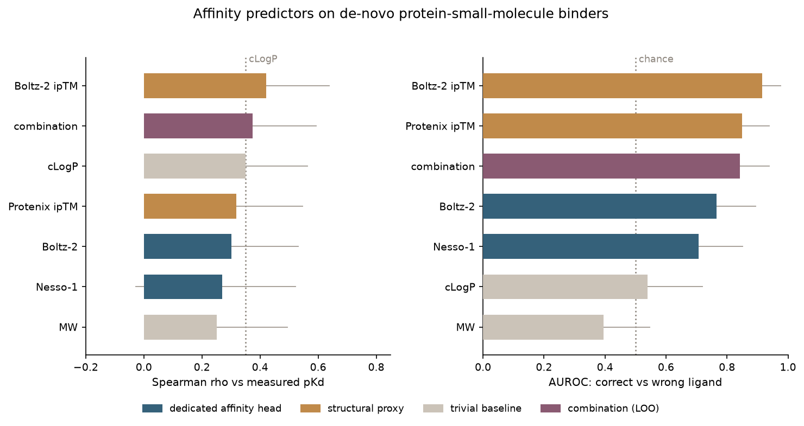

# de-novo small-molecule affinity benchmark

Do protein-ligand affinity predictors work on **de-novo designed** binders? Affinity leaderboards
score them on natural targets; this is a small complementary split built from published de-novo
designs.

**47 protein-ligand pairs:**
- **37 binders** with a measured KD (pKd).
- **10 matched negatives**: the same designed protein paired with a *wrong* ligand (confirmed
  non-binding), so a predictor has to read the interface, not the fold alone.

Five model families, scored two ways (cofolder affinity heads converted to `pK = 6 -
affinity_pred_value`): [Boltz-2](https://github.com/jwohlwend/boltz) (affinity head, ipTM, interface
PAE), [Nesso-1](https://github.com/recursionpharma/nesso) (affinity head),
[Protenix-v2](https://github.com/bytedance/Protenix) (ipTM, gPDE, ranking, interface PAE), and MW /
cLogP baselines, for 15 metric columns in all.

## Results



Left panel: rank affinity among the 37 binders (Spearman vs pKd). Right panel: tell the correct
ligand from the wrong one across all 47 (AUROC). Bars are 95% bootstrap CIs. This shows one metric
per model plus the baselines; the full leaderboard (all 15 metrics) is in
[`figures/benchmark_full.png`](figures/benchmark_full.png), and `score.py` prints every metric.

- **Ranking affinity is hard.** The dedicated affinity heads do not beat lipophilicity: Boltz-2
  +0.41, Nesso-1 +0.33, versus cLogP +0.40. Structural confidence edges ahead (Boltz-2 ipTM +0.54);
  the interface-PAE metrics (min/mean ipae) cluster with it, none breaking out of the ~0.4-0.5 band.
  CIs are wide at n=37.
- **Combining does not help.** A leave-one-out combination of four metrics (+0.56) is statistically
  tied with the best single metric, Boltz-2 ipTM (+0.54): the bootstrap CI on the difference is
  [-0.25, +0.29], spanning 0. For specificity it trails Boltz-2 ipTM (0.83 vs 0.93). No evidence the
  metrics carry complementary signal here.

| task | best single | cLogP | combination (LOO) |
|---|---|---|---|
| rank pKd (Spearman) | +0.54 | +0.40 | +0.56 (tied) |
| tell right from wrong ligand (AUROC) | 0.93 | 0.44 | 0.83 |

## Caveats

Small n (37 + 10): CIs are wide and orderings are suggestive. The 10 negatives are confirmed
non-binders from ~6 designed proteins. The combination does not beat the best single metric (tied
within bootstrap noise). The three cofolders share the AF3-style family, so they are not independent. Cofolder metrics carry
run-to-run diffusion-sampling variation (~0.05 Spearman); values here are from a single seeded fold.
Positive KDs come from mixed assays and are not cross-calibrated.

## Layout

```
reference/experimental_reference_ground_truth.csv   id, is_binder, experimental_pKD
reference/system_reference.csv                       id, protein, ligand_name, sequence, smiles, source, source_url
predictions/<method>_predictions.csv                 method, id, predicted_affinity
```

Every `predictions/*.csv` joins to the reference by `id` and is scored automatically.

## Reproduce

```
# each cofolder needs its own GPU env; baselines are RDKit
CUDA_VISIBLE_DEVICES=0 BOLTZ=/path/to/boltz            python scripts/run_predictors.py boltz
CUDA_VISIBLE_DEVICES=0 NESSO=/path/to/nesso            python scripts/run_predictors.py nesso
CUDA_VISIBLE_DEVICES=0 PROTENIX_DIR=/path/to/Protenix  python scripts/run_predictors.py protenix
python scripts/run_predictors.py baselines
python scripts/score.py
python scripts/make_figure.py
```

## Credit

De-novo designs and labels are from the papers cited per row (`source`, `source_url`) in
`reference/system_reference.csv`.
