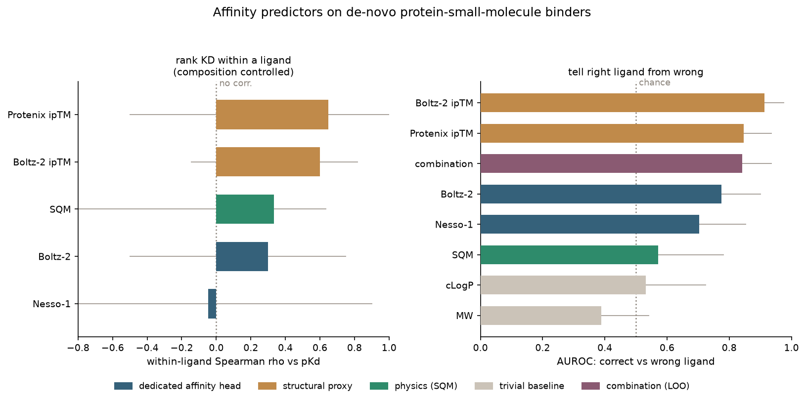

# de-novo small-molecule affinity benchmark

[](https://github.com/ssiddhantsharma/denovo-smallmol-affinity-benchmark/actions/workflows/ci.yml)

Do protein-ligand affinity predictors work on **de-novo designed** binders? Affinity leaderboards
score them on natural targets; this is a small complementary split built from published de-novo
designs.

**60 protein-ligand pairs:**
- **49 binders** with a measured KD (pKd).
- **11 confirmed non-binders**: 8 are a binder's protein paired with a *wrong* ligand, 3 are
  non-binding design variants. Either way a predictor has to read the interface, not the fold alone.

Affinity is ranked **within-ligand**: among the de-novo proteins that bind the *same* ligand, Spearman
of a metric against pKd, median across ligands (the analog of the within-target correlation used on
de-novo protein sets). This is reported rather than a pooled Spearman across all binders on purpose:
the set spans 19 ligands, and a pooled correlation is dominated by ligand composition (cLogP) instead
of the interface, so pooled numbers are a confound, not a result. A ligand-only score like cLogP is
constant within a ligand and drops out, which is the point. Classification (right vs wrong ligand) is
one AUROC over all 60. Cofolder affinity heads are converted to `pK = 6 - affinity_pred_value`.

## Results



Every metric, two panels: within-ligand rank-pKd (left, composition controlled; the dashed line is no
correlation, rho = 0) and right-vs-wrong-ligand AUROC (right; the dashed line is chance, 0.5). Bars
are 95% bootstrap CIs. `score.py` prints every number, including the pooled Spearman kept only for
transparency.

- **Within ligand, co-folder interface confidence leads.** Holding the molecule fixed (median over the
  5 ligands with >= 3 protein binders), the interface-confidence metrics come to the front: Protenix
  ipTM / lig-ipTM +0.65, Boltz-2 ipTM +0.60, Protenix pLDDT-ligand +0.43, interface-PAE in the same
  band. The physics and ML rescorers are middling (SQM +0.33, AEV-PLIG +0.35, GNINA +0.30) and the
  affinity heads trail (Boltz-2 +0.30, Nesso-1 -0.05). This is the same confidence family (iPTM, pTM,
  pLDDT, interface-PAE) that ranks KD on de-novo *protein* sets. CIs are very wide (only 5 ligand
  groups, 3 to 9 binders each), so the ordering is suggestive, not decisive.
- **Specificity also belongs to the co-folders.** On telling the correct ligand from the wrong one,
  the interface-confidence metrics lead: Boltz-2 / Protenix ipTM 0.85 to 0.91, Protenix pLDDT-ligand
  0.86, pTM 0.79. cLogP, dtSFM, and the physics/ML rescorers are near chance. A pure-geometry pose
  baseline, ligand burial (`interface-ligburial`, fraction of the ligand within 4.5 A of the protein),
  reaches 0.71, above cLogP, but carries no affinity-ranking signal (within-ligand rho ~0): the real
  ligand is more buried, yet burial does not order KD.
- **A sequence-native affinity FM fails too; the failure is the data regime, not co-folding.**
  dtSFM (`dtsfm-cosine`), a 714k-pair drug-target specificity foundation model, is at chance on de
  novo (AUROC 0.53, within-ligand +0.10), yet its featurization validates on in-distribution natural
  pairs (true-vs-shuffled AUROC 0.863; `scripts/run_dtsfm.py` gates on that positive control first).

| task | best single | cLogP | combination (LOO) |
|---|---|---|---|
| rank pKd, within-ligand (median Spearman) | +0.65 | n/a (constant per ligand) | not defined |
| tell right from wrong ligand (AUROC) | 0.91 | 0.53 | 0.84 |

## Caveats

Small n (49 + 11): CIs are wide and orderings are suggestive. The 11 negatives are confirmed
non-binders from a handful of designed proteins. This small n reflects the field, not the search: a
systematic survey of the de novo literature turns up essentially no further designed binders of
*organic* small molecules with a precise measured KD. The remaining de novo binders are
metallo-cofactor systems (heme, Zn-porphyrin, Zn-chlorophyll maquettes) or designed pockets grafted
onto natural scaffolds, so the set is close to the available universe rather than a sample of it. The
three cofolders share the AF3-style family, so they are not independent. Cofolder metrics carry
run-to-run diffusion-sampling variation (~0.05 Spearman); values here are from a single seeded fold.
Positive KDs come from mixed assays and are not cross-calibrated.

## Methods scored

Every predictor is a third-party model or tool; this repo only wires it to the split, converts its
outputs to a common convention, and scores it. Full citations are in [References](#references);
please cite the original work when using any result here.

| column(s) | method | family | reference |
|---|---|---|---|
| `boltz-2`, `boltz-2-pbind`, `boltz-2-iptm`, `boltz-2-pae-{min,mean}` | Boltz-2 (affinity head + confidence) | co-folding | Passaro et al. 2025 |
| `nesso-1`, `nesso-1-pbind` | Nesso-1 (affinity head) | co-folding | Recursion / Valence Labs |
| `protenix-{iptm,ligiptm,ptm,plddt-binder,plddt-ligand,gpde,ranking,pae-min,pae-mean}` | Protenix v2 (confidence + ranking) | co-folding | ByteDance AML 2025 |
| `dtsfm-cosine` | dtSFM encoder cosine (drug-target specificity FM) | sequence-native FM | dtSFM-v3, BIIE ETH Zürich |
| `clogp`, `molecular-weight` | Crippen cLogP, molecular weight | physicochemical baseline | RDKit |
| `rowan-sqm`, `rowan-gnina`, `rowan-aevplig` | SQM (PM6-D3H4X/COSMO2), GNINA, AEV-PLIG | physics / docking / ML rescoring | via Rowan |
| `interface-ncontacts`, `interface-ligburial` | protein-ligand contacts and ligand burial from the pose | interface geometry | `scripts/run_interface.py` (gemmi) |

The confidence metrics cover the de-novo metric set used on protein binders (iPTM, pTM, pLDDT,
interface-PAE, contacts). ipSAE and LIS, the strongest there, are protein-protein scores built from
the full residue-residue PAE matrix; that matrix was not saved here, and for a few-atom ligand their
natural analog is lig-ipTM plus interface-PAE, which are included.

De-novo designs and labels are from the papers cited per row (`source`, `source_url`) in
`reference/system_reference.csv`.

## Rowan physics / docking rescoring

The open question this split raises, *does any method actually track KD on de-novo binders, or does
that only work on natural complexes?*, is probed with [Rowan](https://docs.rowansci.com)'s
binding-affinity workflow over scorer families that are not co-folding heads. Each scores a bound
pose (the best-ranked of Protenix v2's 5 samples per system), fed to Rowan through the
[`rowan-python`](https://github.com/rowansci/rowan-python) SDK in its apo-protein + external-pose
mode; SQM additionally runs a protonation (protein-preparation) step first. Wiring is in
`scripts/run_rowan.py`.

- **Physics (SQM) is middling once the ligand is controlled.** Within-ligand, SQM is +0.33, below the
  interface-confidence metrics (ipTM ~0.6). On the confounded pooled Spearman it reaches +0.40, which
  an earlier version of this README over-read as a physics win; that edge was ligand composition, the
  same thing cLogP reads, not the interface.
- **The learned rescorers do not stand out either.** GNINA (within-ligand +0.30) and AEV-PLIG
  (+0.35), both trained on natural complexes (PDBbind-style), stay middling.
- **None of the three help with specificity.** On telling the correct ligand from the wrong one, SQM
  (0.57), GNINA (0.58), and AEV-PLIG (0.47) are all near chance, far below co-folder ipTM (0.91).

So physics and docking rescoring do not beat the co-folders' own interface-confidence metrics here;
the honest read is that nothing in this family clears the bar that ipTM already sets within-ligand.

Caveats: SQM's truncated-pocket energies are noisy (cut salt bridges leave some pockets
electrostatically incomplete). Neither SQM nor AEV-PLIG can score the three silicon-rhodamine dye
systems (COSMO2 has no Si parameters; AEV-PLIG rejects the Si poses), so those cells are blank; GNINA
scores all 60.

## Layout

```
reference/experimental_reference_ground_truth.csv   id, is_binder, experimental_pKD
reference/system_reference.csv                       id, protein, ligand_name, sequence, smiles, source, source_url
predictions/<method>_predictions.csv                 method, id, predicted_affinity
```

Every `predictions/*.csv` joins to the reference by `id` and is scored automatically.

## Reproduce

```
# each cofolder needs its own GPU env; baselines are RDKit
CUDA_VISIBLE_DEVICES=0 BOLTZ=/path/to/boltz            python scripts/run_predictors.py boltz
CUDA_VISIBLE_DEVICES=0 NESSO=/path/to/nesso            python scripts/run_predictors.py nesso
CUDA_VISIBLE_DEVICES=0 PROTENIX_DIR=/path/to/Protenix  python scripts/run_predictors.py protenix
python scripts/run_predictors.py baselines
python scripts/score.py
python scripts/make_figure.py

# Rowan physics/docking rescoring (needs Protenix poses in _work/px_out + a ROWAN_API_KEY)
python scripts/run_rowan.py                       # dry run: split poses, print the plan
ROWAN_API_KEY=... python scripts/run_rowan.py --submit --methods sqm,gnina,aevplig --max-credits 300
```

## References

Models and scorers:

- **Boltz-2**: Passaro, Corso, Wohlwend, et al. *Boltz-2: Towards Accurate and Efficient Binding
  Affinity Prediction.* bioRxiv (2025). Code: [jwohlwend/boltz](https://github.com/jwohlwend/boltz).
- **Nesso-1**: Recursion / Valence Labs. *Nesso-1* technical report and model card:
  [recursionpharma/nesso](https://huggingface.co/recursionpharma/nesso).
- **Protenix v2**: ByteDance AML AI4Science Team (Chen et al.). *Protenix: Advancing Structure
  Prediction Through a Comprehensive AlphaFold3 Reproduction.* bioRxiv (2025),
  [doi:10.1101/2025.01.08.631967](https://doi.org/10.1101/2025.01.08.631967).
- **dtSFM**: Specificity Foundation Model, BIIE, ETH Zürich. Weights
  [SFM-BIIE-ETHZ/dtSFM-v3](https://huggingface.co/SFM-BIIE-ETHZ/dtSFM-v3); features from MoLFormer-XL
  (Ross et al., *Nat. Mach. Intell.* 2022) and ESM2 (Lin et al., *Science* 2023).
- **GNINA**: McNutt, Francoeur, Aggarwal, et al. *GNINA 1.0: molecular docking with deep learning.*
  *J. Cheminform.* 13, 43 (2021). Code: [gnina/gnina](https://github.com/gnina/gnina).
- **AEV-PLIG**: Valsson, Warren, Deane, Magarkar, Morris, Biggin. *Narrowing the gap between machine
  learning scoring functions and free energy perturbation using augmented data.* (2025),
  [PMC11807228](https://www.ncbi.nlm.nih.gov/pmc/articles/PMC11807228/).
- **SQM (PM6)**: Stewart. *Optimization of parameters for semiempirical methods V.* *J. Mol. Model.*
  13, 1173 (2007). Run via Rowan as PM6-D3H4X with COSMO2 solvation.

Software:

- **rowan-python** SDK: Rowan Scientific,
  [rowansci/rowan-python](https://github.com/rowansci/rowan-python).
- **RDKit**: Landrum et al. *RDKit: Open-source cheminformatics*, [rdkit.org](https://www.rdkit.org).
- **gemmi**: Wojdyr. *GEMMI: A library for structural biology.* *J. Open Source Softw.* 7, 4200 (2022).
- **scikit-learn**: Pedregosa et al. *Scikit-learn: Machine Learning in Python.* *JMLR* 12, 2825 (2011).
- **NumPy**: Harris et al. *Array programming with NumPy.* *Nature* 585, 357 (2020).
- **Matplotlib**: Hunter. *Matplotlib: A 2D graphics environment.* *Comput. Sci. Eng.* 9, 90 (2007).

## Acknowledgements

The physics/docking rescoring is made possible by compute credits generously provided by
[Rowan Scientific](https://rowansci.com) ([@RowanSci](https://x.com/RowanSci)), with thanks to
[Corin Wagen](https://x.com/cwagen) for the credits. See [References](#references) for the models,
scorers, and libraries this benchmark builds on.
